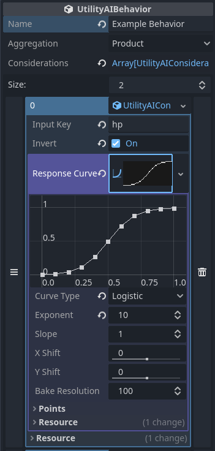

# Utility AI for Godot

A collection of scripts and resources for implementing utility-based AI in
Godot.

## Installation

To install, follow the latest instructions for [installing
plugins](https://docs.godotengine.org/en/stable/tutorials/plugins/editor/installing_plugins.html)
in the Godot documentation.

## Getting Started

- Define abstract *behaviors* in terms of one or more *considerations*.
- Create *response curves* to determine the *utility* of your behaviors.
- Create concrete *options* combining a behavior, a specific decision
  *context*, and an in-game *action* to perform if the behavior is chosen.
- Choose between available options based on their utility score.

Behaviors, considerations, response curves and options can be edited directly
in the Inspector:

Since actions and contexts describe the interaction between the utility AI
system and the rest of the game, their implementations are game-specific.
Simple examples of using the plugin are available in the [examples](examples)
directory.

Additional documentation is available in Godot's help window after installing
the plugin.

## License

The plugin is distributed under the MIT license. See [LICENSE](LICENSE) for
more information.

Tests and examples are distributed under the Zero-Clause BSD license. See
[tests/LICENSE](tests/LICENSE) for more information.

The logo is licensed under the Creative Commons Attribution 4.0 International
License. See [logo/LICENSE](logo/LICENSE) for more information.

## For More Information

- [An Introduction to Utility
  Theory](http://www.gameaipro.com/GameAIPro/GameAIPro_Chapter09_An_Introduction_to_Utility_Theory.pdf),
David "Rez" Graham
- [Improving AI Decision Modeling Through Utility
  Theory](https://www.gdcvault.com/play/1012410/Improving-AI-Decision-Modeling-Through),
Dave Mark & Kevin Dill
- [Building a Better Centaur: AI at Massive
  Scale](https://www.gdcvault.com/play/1021848/Building-a-Better-Centaur-AI),
Dave Mark & Mike Lewis
